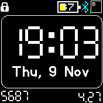
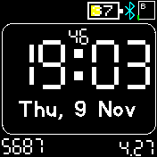
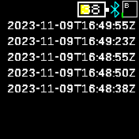

# TimeStamp Watch

Describe the app...

Add screen shots (if possible) to the app folder and link then into this file with 

## Usage

Describe how to use it

## Features

- daily steps
- daily walked distanse

## Controls

Name the buttons and what they are used for

## Requests

Name who should be contacted for support/update requests

## Creator

mvb (https://github.com/mvbasov
